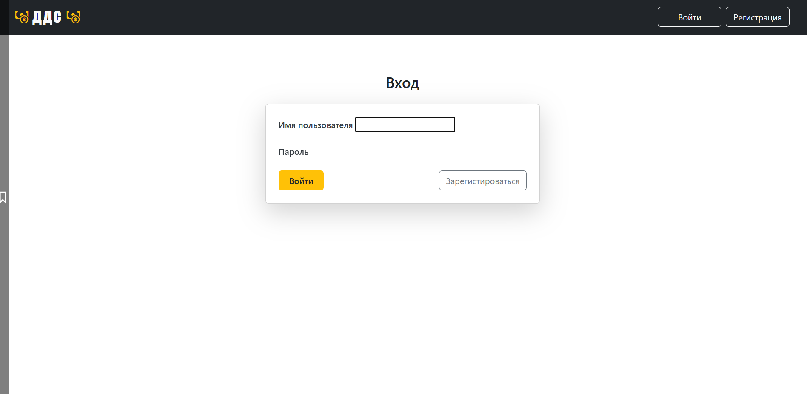
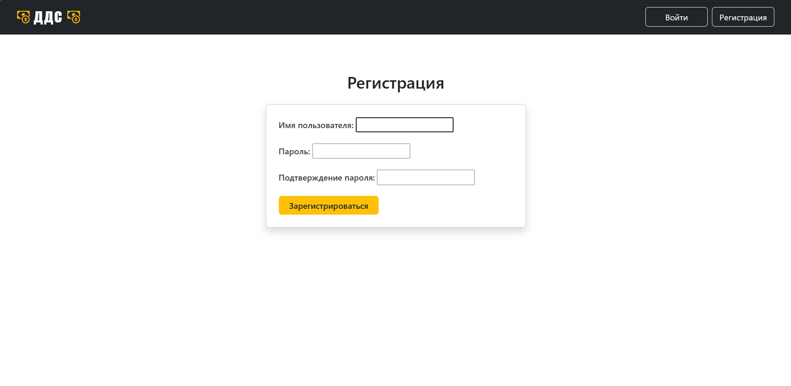
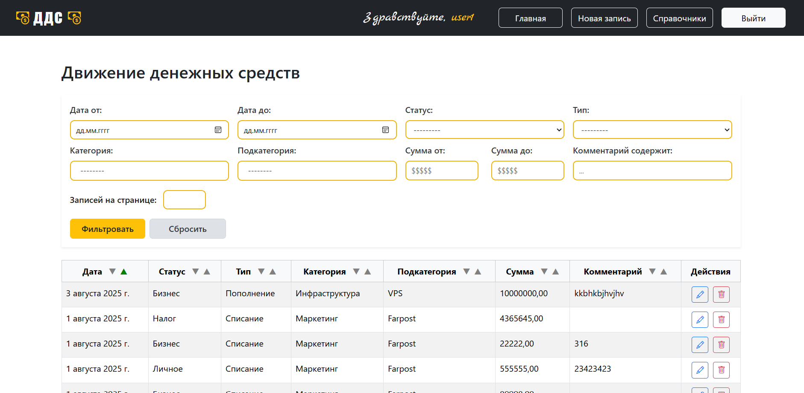

# Веб-сервис для управления движением денежных средств (ДДС)

Тестовое задание для компании "Первая IT-компания".

---

## Описание

С помощью данного веб-приложения пользователь может вести учет всех
денежных операций. Оно позволяет создавать, редактировать, 
удалять и просматривать записи о движении денежных
средств. 
Приложение имет понятный интерфейс и обеспечивать следующую функциональность и особенности:
- Аутентификация пользователя с помощью встроенного представления и регистрация с помощью кастомного.
Данные пользователя включают только имя и пароль.
- Созданы модели для ДДС-записей, статусов, типов, категорий и подкатегорий.
- Оформлена панель администратора с возможностью редактирования суперпользователем всех записей всех моделей. Важно: 
только суперпользователь и только в админ панели может задать любого пользователя любой записи; 
создавая запись через пользовательский интерфейс, данные для поля user в модели подгружаются автоматически исходя из
данных аутентифицированного пользователя.
- В пользовательском интерфейсе реализован просмотр всех ДДС-записей на главной странице в виде таблицы.
- С помощью формы фильтрации можно задать: промежуток дат, тип, статус, категорию, подкатегорию, промежуток суммы,
вхождение в комментарий и пагинацию (максимальное количество записей на странице). Фильтрация сохраняется в сессии и выполняется на серверной стороне.
- Также с помощью JS по каждому столбцу реализована сортировка на клиентской стороне. По умолчанию - сортировка по дате по убыванию.
- Пользователь может просматривать, удалять, добавлять или редактировать любую свою запись.
- Пользователю доступно создание, просмотр и редактирование всех справочников (тип, статус и пр.) с установлением всех зависемостей.
- Для работы с моделями справочников в качестве оптимизации созданы универсальные динамические шаблоны и форма, создан 
прикладной тег для обеспечения необходимого функционала в шаблонах.
- Во всех формах, где учитвается зависимость, происходит реактивная подгрузка полей, фильтрованная по выбору в связанном поле
  (например, при выборе типа фильтруются категории) с помощью библиотеки django-autocomplete-light. В том числе в админ панели!
Также обеспеченна валидация форм, если пользователь как-то таки сможет отправить данные с некорректными связями.
- Стилизация шаблонов произведена с помощью Bootstrap и Bootstrap Icons, а также собственного css.
- Код соответствует стандарту PEP8.
- Переменные окружения выведены в отдельный файл .env. Для работы с ними используется библиотека dotenv.
- Для чистоты кода были использованы black, isort и flake8.

---

## Технологический стек
* Язык: Python 3.8+.
* Веб-фреймворк: Django 5+ (с использованием встроенной ORM).
* Шаблонизация: Django Templates для создания HTML-страниц.
* Стилизация: Bootstrap и Bootstrap Icons.
* База данных: PostgreSQL (по умолчанию).

---

## Установка и настройка
0) Предварительно необходимо настроить переменные окружения (.env) и удобную для вас реляционную БД (создать в ней роль и таблицы).

1) Клонируем репозиторий:
```bash
git clone https://github.com/MLKolt/FirstIT_Test.git
```
2) Создаем виртуальное окружение:
```bash
python -m venv .venv
# на Linux/macOS:
source .venv/bin/activate
# на Windows:
.venv\Scripts\activate
```
3) Устанавливаем зависимости:
```bash
pip install --upgrade pip
pip install -r requirements.txt
```
4) Создаём и применяем миграции:
```bash
py manage.py makemigrations
py manage.py migrate
```
5) Создаем суперпользователя:
```bash
py manage.py createsuperuser
```

## Работа с приложением
1) Запуск сервера:
```bash
py manage.py runserver
```

---

## Скриншоты проекта:
1) Страница входа:
  
  

2) Страница регистрации:
  
  

3) Главная страница:
  
  

4) Создание записи:
  
  

5) Навигационная панель справочников:


6) Детальная информация справочника:

